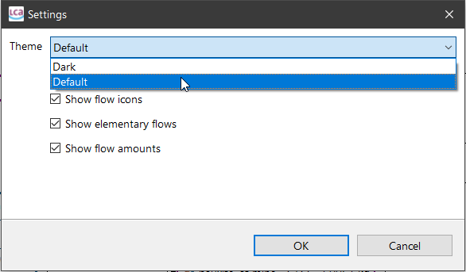
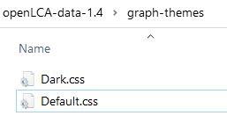
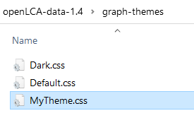
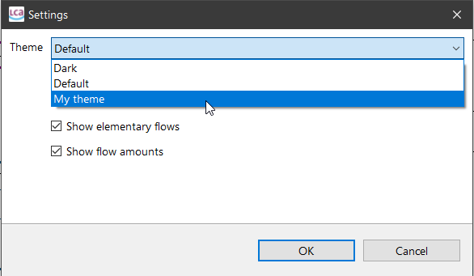
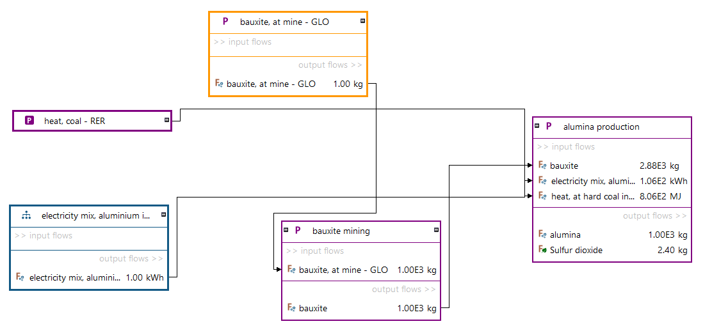
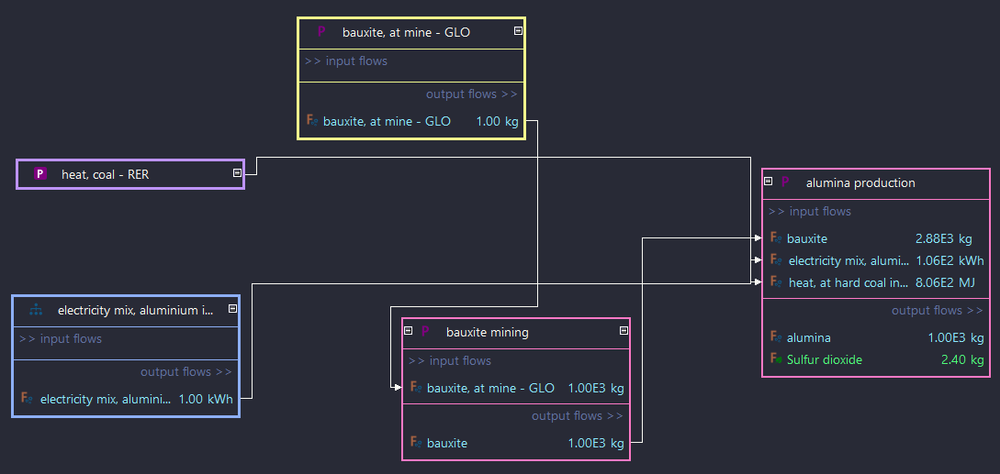

# CSS styling for the graphical editor in openLCA

In openLCA 2, you can select a color theme for the graphical editor (via the
context menu of the editor > settings):



A theme can be configured in a CSS file. openLCA 2 stores these CSS files in the
`graph-themes` folder of the openLCA workspace (which is currently still
`~/openLCA-data-1.4`; on Windows `C:/Users/[YOU]/openLCA-data-1.4`):




## Creating a new theme

A new theme can be added by simply adding a CSS file to that folder:



The easiest way to create a new theme is to copy an existing one. The comments
in the [default theme CSS files](./src/main/resources/org/openlca/app/editors/graphical/themes/Dark.css)
should be helpful:

```css
/* basic attributes and graph settings */
:root {
  --name: 'Dark';         /* the name of the theme */
  --mode: 'dark';         /* this is a dark theme */
  background: #282a36;    /* the background color of the graph */
}

/* -- process boxes -- */

/* defaults */
.box {
  color: #f8f8f2;       /* font color */
  background: #282A36;  /* background color */
  border: 2px #ff79c6;  /* border width and color */
}

/* ... */
```

When you reopen the settings dialog, you should then see your new theme:




## Current themes

Note that we only support a small subset of CSS for our themes (e.g. just
hex-values for colors like `#123456` and a few color names like `blue` or
`red`). Currently, the following themes are included in openLCA 2:

* [Default](./src/main/resources/org/openlca/app/editors/graphical/themes/Default.css):



* [Dark](./src/main/resources/org/openlca/app/editors/graphical/themes/Dark.css):




The following elements can be currently styled:

* [x] background color of the graph
* [x] process type dependent font colors, border colors, border widths, and
      background colors of process boxes
* [ ] flow type dependent colors for process links (not yet implemented in the
      UI)
* [x] font colors for headers
* [x] flow type dependent font colors for inputs and outputs

We are thinking about adding these additional features:

* [ ] support for rounded borders
